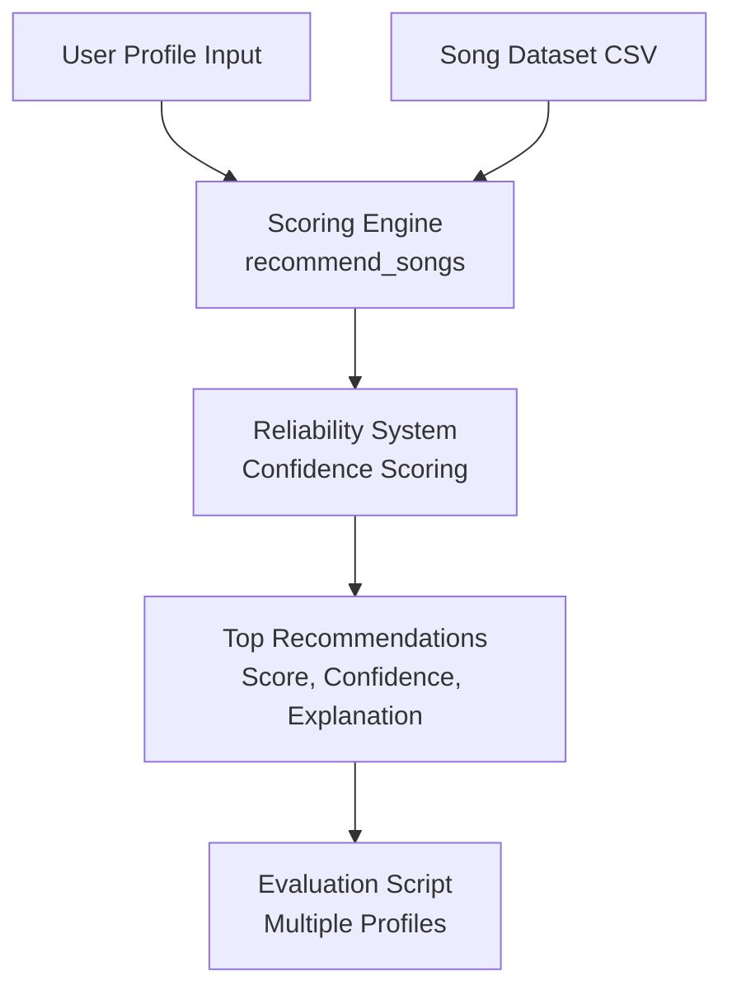

# System Architecture Diagram

```mermaid

flowchart TD
    A[User Profile Input]
    B[Song Dataset CSV]
    C[Scoring Engine<br/>recommend_songs]
    D[Reliability System<br/>Confidence Scoring]
    E[Top Recommendations<br/>Score, Confidence, Explanation]
    F[Evaluation Script<br/>Multiple Profiles]

    A --> C
    B --> C
    C --> D
    D --> E
    E --> F
```
